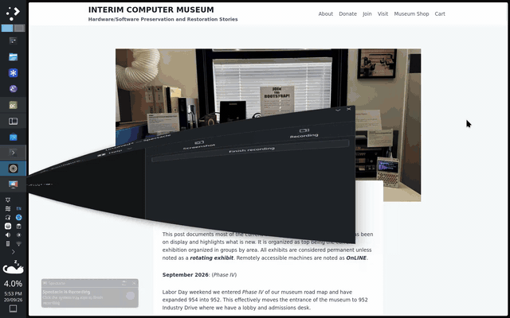

# Tokri

> A desktop basket to drag and drop text, URLs, images, and files.

- Shake while dragging to open the basket and drop items inside.
- Drag items **out** to move them
- Hold Ctrl (Windows/Linux) or ⌥ Option (macOS) while dragging to copy

## Demo


## Download

### Windows
- Installer: [TokriSetup.exe](https://github.com/jarusll/tokri/releases/latest/download/TokriSetup.exe)
- Portable (.zip): [Tokri.zip](https://github.com/jarusll/tokri/releases/latest/download/Tokri.zip)

### macOS
- DMG installer: [Tokri.dmg](https://github.com/jarusll/tokri/releases/latest/download/Tokri.dmg)

> **Note for macOS users**
>
> This app is **unsigned**, so macOS will block it.
>
> To run it:
>
> - Run in Terminal:
>   ```zsh
>   sudo /usr/bin/xattr -dr com.apple.quarantine /Applications/Tokri.app
>   ```
>
> Or allow it via:
> **System Settings → Privacy & Security → Open Anyway**

### Linux
- Flatpak bundle: [com.ysuraj.Tokri.flatpak](https://github.com/jarusll/tokri/releases/latest/download/com.ysuraj.Tokri.flatpak)

> **Note for Linux users**
>
> This application reads from `/dev/input/*` to detect mouse activation gestures.
> Add your user to the `input` group:
>
> ```bash
> sudo usermod -aG input $USER
> ```
>
> Log out and log back in for the change to take effect.

## Acknowledgements
- [KDAB](https://www.youtube.com/@KDABtv) for their awesome Qt learning resources
- 🎨 Icons and colors by [Akshay Majgaonkar](https://www.linkedin.com/in/akshay-majgaonkar/)
